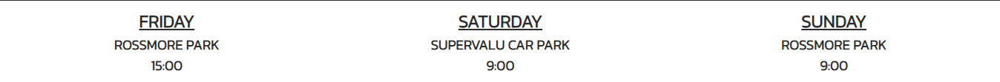

# The Clean Bunch

The Clean Bunch website is a landing page for anyone who is looking to join The Clean Bunch litter picking group. 
The Clean Bunch is based in Monaghan, but we aim to raise awareness about the importance of responsible waste disposal and encourage others to take action in their own communities.

The website offers all the information about The Clean Bunch: A short about us section, meeting times, a gallery and a sign up form.

## Features

- **Site**
    - I chose the colors of the Irish flag for my website to pay homage to the Irish culture, but to also make a statement about the importance of unity and cooperation in tackling environmental issues.

- **The Header** 
    - The header shows the name of the group as well as one of the colors found in the Irish flag.
    - The name tells the user what we are about: we are a group of individuals that care about the environment.

- **Navigation**
    - Under the header you can find the navigation bar, which contains links to the different sections of the same page.
    -The navigation bar contains links to the Home page, Gallery page and the Get Involved page which leads to the sign up form.

- **Join The Clean Bunch Section**
    - The Join The Clean Bunch or the About Us section contains the basic information about The Clean bunch, and highlights our values.
    - The text and the image in this section show the user what we are about and why they should join us.

- **Mission**
    - The Mission section tells the user about what we actually do, we collect waste from the environment and we keep it clean.
    - This section tells the user a little more about our values and why they should join us.

- **Meetup Times**
    - This section contains the weekly meetup times

- **Footer**
    - The footer contains the social media links

- **Gallery**

- **The Signup Form**